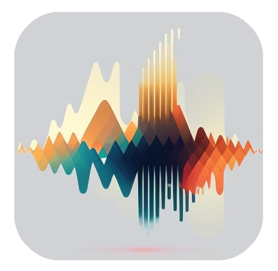
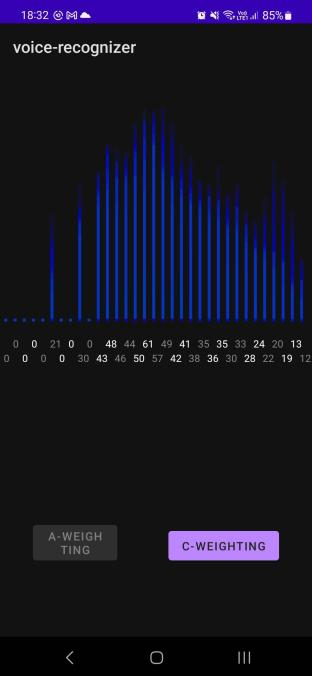

# Spectrum Visualizer

     

Android application for visualization of signal frequency spectrum. Processes the time signal from the microphone using FFT and A-weighting or C-weighting. Depicts the sound amplitude for each thirds.

## Release

`
1.0
`

## Preview

  

## Technologies

- KotlinDL 0.4.0
- Kotlin 1.7.10

## Requirements

- Android SDK 33
- Gradle 8.0.0
